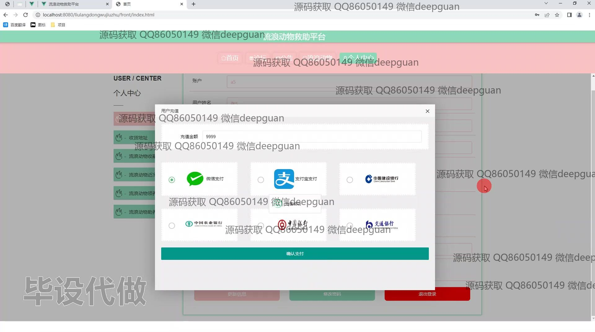

<h1 align="center">基于JAVA的流浪动物救助平台的设计与实现</h1>

## 简介
流浪动物救助平台：角色分为管理员、用户；功能包括用户注册、个人中心管理、流浪动物信息管理、动物领养、助养和订单审核等，提供流浪动物的详细资料展示和相关消费管理。    --计算机毕业设计源码；毕设源码；java毕业设计源码

## 联系方式

<h3 align="center">获取完整代码与数据库文件 + 微信：deepguan QQ: 86050149 QQ群: 783742310</h3>

<h3 align="center">可帮忙远程部署 包运行成功！提供远程部署、修改代码、设计文档指导、代码讲解等服务！</h3>

## 功能介绍（完整见运行截图）
管理员：管理员可以通过系统界面进行登录、注册和退出操作。管理界面提供对流浪动物救助订单的审核功能，包括填写审核意见及管理物流信息。还可以管理基础数据，如动物类型、消费类型、用户信息等，以及操作流浪动物的助养与领养订单。管理员能够通过录入表单录入流浪动物的信息，并监督用户维护与管理功能，确保平台的正常运作。

用户：用户可以在平台上注册、登录以及退出。用户中心提供个人信息的编辑、地址管理、充值以及查看和管理助养流浪动物的记录功能。用户可以通过平台助养或领养流浪动物，浏览并查询各种流浪动物的信息，包括动物详细资料和助养、领养流程。在论坛模块，用户能够参与社区交流，发布和回复帖子，分享信息及反馈。

平台整体功能包括：提供清晰的导航菜单和信息录入表单，支持流浪动物的认领、助养、费用管理等，界面设计现代，注重用户体验与互动，支持多种支付方式完成交易，丰富了用户在救助流浪动物过程中的交互行为与管理需求。同时，平台通过数据审核和订单管理来保障信息的准确性和有效执行。

## 运行截图

本代码来源于网络,仅供学习参考使用!

